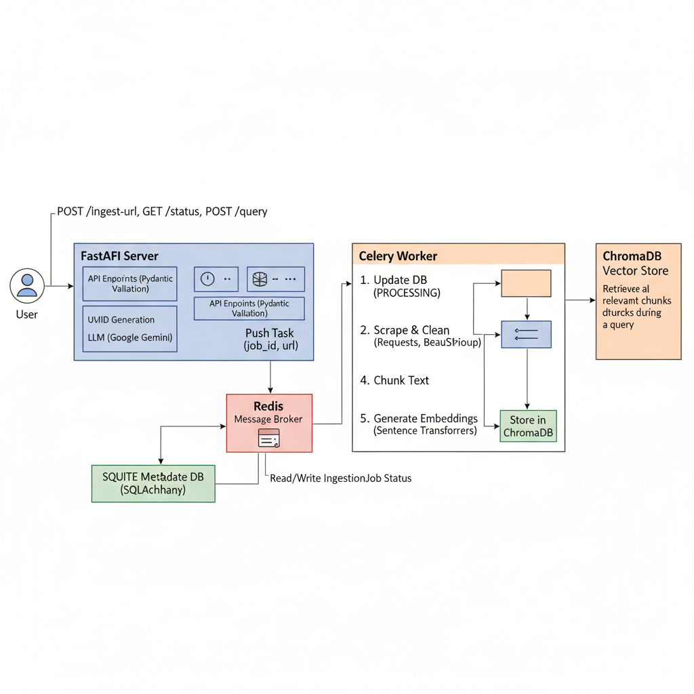

# Scalable, Web-Aware RAG Engine

This project is a scalable, web-aware Retrieval-Augmented Generation (RAG) engine, built as a technical assessment for the AI Engineer position at AiRA.

The system is designed to asynchronously ingest content from any URL, process it into a vector knowledge base, and provide a query interface to ask questions and receive grounded, fact-based answers from the ingested content.

-----

##  Demo Video

**[Watch the Demo Video Here](https://drive.google.com/drive/folders/1DR8EXd6e1NON7G8JjsPY3Z8qLDf75vt_?usp=sharing)**

-----

##  System Architecture

The system is designed as a set of decoupled microservices that communicate via a message broker (Redis). This ensures that the user-facing API remains fast and responsive, regardless of how long the web scraping and embedding process takes.

### System Diagram

*(Note: Please create this diagram and add it to your repo as `architecture.png`)*



-----

### 1. Asynchronous Ingestion Workflow

1.  A user sends a `POST /ingest-url` request with a URL to the **FastAPI Server**.
2.  FastAPI validates the URL, creates a new `IngestionJob` in the **SQLite** metadata database with a `PENDING` status, and immediately returns a `202 Accepted` response with the `job_id`.
3.  Simultaneously, FastAPI pushes a new task with the `job_id` and `url` onto the **Redis** message queue.
4.  The **Celery Worker** (running in a separate process) pulls the task from the queue.
5.  The worker updates the job status to `PROCESSING` in the SQLite DB.
6.  It scrapes the web content, cleans the text, splits it into overlapping chunks, and generates vector embeddings for each chunk using `sentence-transformers`.
7.  The embeddings and text chunks are stored in the **ChromaDB** vector store.
8.  The worker updates the job status to `COMPLETED` in the SQLite DB. If any step fails, it's marked as `FAILED` with an error message.

### 2. Query Workflow

1.  A user sends a `POST /query` request with a question to the **FastAPI Server**.
2.  FastAPI generates an embedding for the user's query using the same `sentence-transformers` model.
3.  It queries **ChromaDB** to find the top 5 most semantically similar text chunks from the knowledge base.
4.  These chunks (the "context") and the original query are passed to the **Google Gemini (gemini-1.5-flash) LLM** via a grounding prompt.
5.  The LLM generates an answer based *only* on the provided context.
6.  FastAPI returns the grounded answer to the user.

-----

##  Technology Stack & Justification

| Technology             | Role                 | Justification                                                                                                                                                 |
| :--------------------- | :------------------- |:--------------------------------------------------------------------------------------------------------------------------------------------------------------|
| **Python**             | Core Language        | The universal language for AI/ML and web services.                                                                                                            |
| **FastAPI**            | API Framework        | Chosen for its high performance, native `async` support, and Pydantic data validation, making the API fast and robust.                                        |
| **Celery + Redis**     | Task Queue & Broker  | The industry standard for managing asynchronous background tasks. Redis is a lightweight, fast, and reliable broker.                                          |
| **Gevent**             | Celery Worker Pool   | Used as the execution pool for Celery. This is **critical for Windows compatibility** and solves process-spawning issues.                                     |
| **SQLite**             | Metadata Database    | Used for this demo due to its zero-setup, file-based nature. The schema is built with SQLAlchemy, making it trivial to swap to **PostgreSQL** for production. |
| **ChromaDB**           | Vector Store         | A lightweight, persistent, open-source vector database that's easy to set up and run locally.                                                                 |
| **SentenceTransformers** | Embedding Model      | A high-performance, open-source model (`all-MiniLM-L6-v2`) that runs locally, ensuring data privacy and no external API calls for embedding.                  |
| **Google Gemini**      | LLM                  | Used for the final generation step. `gemini-2.5-pro` provides a powerful, fast, and state-of-the-art model to generate answers.                               |

-----

##  Database Schema

The metadata store uses a single SQLAlchemy table, `ingestion_jobs`, to track the status of each URL.

| Column        | Type     | Description                                                          |
| :------------ | :------- | :------------------------------------------------------------------- |
| `id`          | `UUID`   | Primary Key, generated by `uuid.uuid4`.                              |
| `url`         | `String` | The URL submitted by the user.                                       |
| `status`      | `Enum`   | The current job status: `PENDING`, `PROCESSING`, `COMPLETED`, `FAILED`. |
| `error_message` | `String` | Stores the exception message if the job status is `FAILED`.          |
| `created_at`  | `DateTime` | Timestamp of when the job was created.                               |
| `updated_at`  | `DateTime` | Timestamp of the last status update.                                 |

-----

##  API Documentation

The API is fully documented and testable at `http://127.0.0.1:8000/docs` (via OpenAPI/Swagger).

### 1. Ingest a new URL

Accepts a URL, creates a background job, and returns the job ID.

-   **Endpoint:** `POST /ingest-url`
-   **Status Code:** `202 Accepted`
-   **Request Body:**
    ```json
    {
      "url": "https://en.wikipedia.org/wiki/Albert_Camus"
    }
    ```
-   **Curl Example:**
    ```bash
    curl -X 'POST' \
      'http://127.0.0.1:8000/ingest-url' \
      -H 'accept: application/json' \
      -H 'Content-Type: application/json' \
      -d '{
        "url": "https://en.wikipedia.org/wiki/Albert_Camus"
      }'
    ```

### 2. Check Ingestion Status

Retrieves the status of a specific ingestion job.

-   **Endpoint:** `GET /ingest-url/status/{job_id}`
-   **Status Code:** `200 OK`
-   **Curl Example:**
    ```bash
    curl -X 'GET' \
      'http://127.0.0.1:8000/ingest-url/status/c155fd86-d977-41dc-b773-26db34a9591e' \
      -H 'accept: application/json'
    ```

### 3. Query the Knowledge Base

Asks a question and gets a grounded answer from the ingested content.

-   **Endpoint:** `POST /query`
-   **Status Code:** `200 OK`
-   **Request Body:**
    ```json
    {
      "query": "When did Albert Camus die?"
    }
    ```
-   **Curl Example:**
    ```bash
    curl -X 'POST' \
      'http://127.0.0.1:8000/query' \
      -H 'accept: application/json' \
      -H 'Content-Type: application/json' \
      -d '{
        "query": "When did Albert Camus die?"
      }'
    ```

-----

##  Setup & Running Instructions

### Prerequisites

-   Git
-   Python 3.9+
-   Docker Desktop (for Redis)

### 1. Clone & Configure the Project

```bash
# 1. Clone the repository
git clone https://github.com/YOUR_USERNAME/YOUR_REPO_NAME.git
cd YOUR_REPO_NAME

# 2. Create and activate a virtual environment
python -m venv venv
source venv/bin/activate  # On Windows: venv\Scripts\activate

# 3. Install dependencies
pip install -r requirements.txt

# 4. Create your .env file
# (Copy .env.example to .env)
cp .env.example .env

# 5. Edit the .env file and add your Google API key
# GOOGLE_API_KEY="AIzaSy...your...key"
```

### 2. Run the Services (The 3 Terminals)

You must have three separate terminals open to run the full stack.

#### Terminal 1: Start Redis

This launches the Redis message broker using Docker.

```bash
docker compose up
```
#### Terminal 2: Start the Celery Worker
This starts the background worker that listens for jobs from Redis.
```bash
# -P gevent is CRITICAL for Windows compatibility
celery -A worker.celery_app worker --loglevel=info -P gevent -c 100
```
#### Terminal 3: Start the FastAPI Server
This starts the user-facing API on http://127.0.0.1:8000.
```

uvicorn main:app --reload
```
### 3. Test with the API
Your system is now fully operational.

Go to: http://127.0.0.1:8000/docs in your browser.

Step 1: Use the /ingest-url endpoint to add a URL (e.g., https://www.britannica.com/biography/Albert-Camus).

Step 2: Use the /ingest-url/status/{job_id} endpoint to check when its status becomes COMPLETED.

Step 3: Use the /query endpoint to ask a question (e.g., "What was Camus's philosophy?").